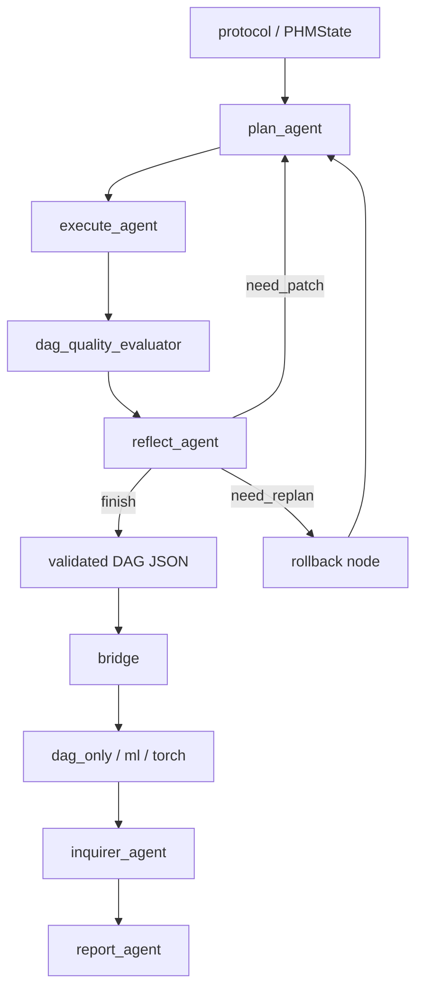

# PHMGA

PHMGA 是一个面向论文复现与方法验证的工业时间序列研究仓库，不再承担旧版“通用多智能体平台”的定位。当前仓库只围绕一条清晰主链组织：

`protocol -> PHMState/StateGraph -> plan_agent -> execute_agent -> dag_quality_evaluator -> reflect_agent -> validated DAG JSON -> bridge -> graph-dependent artifacts -> inquirer_agent -> report_agent`

## 当前定位

- 目标：用最小研究闭环支撑论文版 PHMGA，而不是维护历史平台兼容层。
- 前端：`Configuration + PHMState + LangChain agents + LangGraph runtime` 生成结构先验 DAG。
- 中间：`dag + operators + bridge` 将结构先验固化为 validated DAG JSON，并编译到不同 graph path。
- 后端：`model + training + evaluation` 输出 graph-dependent artifacts 和最终报告。
- `dag_quality_evaluator` 位于 `execute` 和 `reflect` 之间，只负责生成当前 round 的紧凑质量摘要。
- 当前前端 runtime 已切到 LangGraph；`rollback` 是显式节点，不再是脚本内隐式分支。
- 根默认配置下，`report_agent` 仍可走 deterministic / rule-based renderer，经由 `OfflineLLM.render_report()` 输出 markdown；formal main presets 则已显式切到 provider-backed run。
- `inquirer_agent` 已恢复为 downstream evidence agent 入口，但它不参与 DAG 生成决策，只消费 path artifacts 补充 similarity / evidence chain。

## 当前算子系统

当前算子系统保持统一执行骨架：

`BaseIsomorphicOperator + OperatorSpec + OperatorCatalog`

但 schema 语义已经按 `/home/user/LQ/C_Agent/PHMGA/src/tools/readme.md` 收敛到五类：

- `EXPAND`
- `TRANSFORM`
- `AGGREGATE`
- `MULTI_VARIABLE`
- `DECISION`

这里保留 `BaseIsomorphicOperator` 的原因是：同一算子语义仍要同时服务 `np / pt / sym` 多后端，以及 planner / executor / bridge / report 多表示合同；分类与 rank 行为改由 `schema_category + rank_class + input_spec + output_spec` 表达，而不是回退到旧多基类体系。

当前首轮已实现的高价值算子包括：

- `signal.stft`
- `signal.patch`
- `signal.filter`
- `signal.hilbert_envelope`
- `signal.psd`
- `feature.kurtosis`
- `feature.crest_factor`
- `feature.band_power`
- `feature.spectral_centroid`
- `multi.cross_correlation`
- `decision.threshold`

当前 operator contract 现在要求：

- `np / pt / sym` 三种 execution surface 都要明确声明
- `.venv` 默认环境必须安装 GPU 版 `torch+cu118`
- 当前仓库的标准执行环境是仓库根目录下的 `.venv`，不是外部 `conda` 环境
- 这里的 operator-level `forward_pt` 已进入 graph-level `torch` path 的单父 feature execution，但不代表 multi-parent compiled support 已完成
- 当前 operator-level `forward_pt` 已优先 native 化 `stft / psd / hilbert_envelope` 等热点；`filter` 与 `kurtosis` 仍短期保留统一 CPU bridge

## 三条 graph path

- `dag_only`
  - 生成 DAG JSON、结构图、节点边清单、decision side outputs、方法说明和 `final_report.md`。
- `ml`
  - 将 DAG 编译成特征流水线，运行轻量 ML 基线，输出 `feature_pipeline.json`、`metrics.json`、`predictions.json`、`importance.json`。
- `torch`
  - 将 DAG 编译成可训练构建计划，运行最小训练后端，输出 `model_build_plan.json`、`training_curves.json`、`checkpoint.json`、`importance.json`、`metrics.json`。
  - 当前实现已切到 graph-level operator PT execution，并使用最小 torch tensor runtime 训练线性头。
  - 它仍不是完整 research-grade PyTorch 训练栈；当前只支持单进程单设备。
  - `ml / torch` 已切到 multi-parent compiled plan，并支持 config-driven `output_policy`：
    - `terminal_only`
    - `include_intermediate_features`

## 当前仓库骨架

- `doc/structure/`
  - 论文版结构文档与删除账本，是当前设计权威说明。
- `config/`
  - Hydra root config 位于 `config/config.yaml`，再按 `data/`、`experiment/`、`model/` 分组；`config/runs/` 作为论文实验 preset。
- `main.py`
  - 正式 Hydra 入口；根据 `runtime.action` 分派 `preflight` 或 `run_case`。
- `scripts/preflight.py`
  - 兼容入口与底层实现。
- `scripts/run_case.py`
  - 兼容入口与底层实现；内部已切到 LangGraph `StateGraph` 前端 runtime，并在 `finish` 后通过 bridge 编译和执行 graph path。
- `src/`
  - 最小研究核心，不保留旧 `main.py`、`src/tools`、`src/cases`、`src/graph` 等平台式入口。
- `tests/unit/` 与 `tests/smoke/`
  - 分别覆盖合同和最小端到端闭环。

## 配置组织

正式运行入口是根目录 `main.py` 配合 Hydra 配置。当前推荐使用 `config/runs/*.yaml` 作为 preset。

配置组织分为两层：

- `config/config.yaml`
  - Hydra root config，包含默认组合、`runtime.action`、LLM、artifact、模型参数以及 `evaluation.dag_quality`。
- `config/data/*.yaml`
  - 数据协议与数据来源。
- `config/experiment/*.yaml`
  - graph path 选择。
- `config/runs/*.yaml`
  - 作为 Hydra preset，固定一组论文实验组合。

当前最重要的几个字段：

- `runtime.action`
  - 选择 `preflight` 或 `run_case`。
- `llm`
  - `config/config.yaml` 默认仍是 `offline_stub`，用于无外部依赖的最小闭环。
  - 基座模型 id 已预置为 `stepfun/step-3.5-flash:free`；只有 `mode=provider` 时才会真正调用。
  - formal main presets (`config/runs/{ottawa,rm101}_{ml,torch}.yaml`) 已显式切到 `mode=provider` + `provider=openrouter` + `model=stepfun/step-3.5-flash:free`。
  - `offline_stub` 仍保留为 pilot / deterministic baseline。
- `evaluation.dag_quality`
  - DAG 质量摘要的开关，以及小样本 proxy probe 的控制项。
  - 当前默认语义是：synthetic 关闭 proxy probe，real 开启 proxy probe；当 `use_proxy_probe: null` 时按 `source_mode` 自动推断。
- `model.ml`
  - 轻量 ML 路径的训练参数。
  - 当前也承载 `output_policy`。
- `model.torch`
  - 当前最小 trainable path 的训练参数。
  - 当前承载：
    - `phase`
    - `device`
    - `output_policy`

真实数据配置已经接入两套 PHM-Vibench 数据：

- `config/data/rm101.yaml` -> `RM_101_THU_GEARBOX`
- `config/data/ottawa.yaml` -> `RM_017_Ottawa19`

它们都通过 `metadata_path + h5_path` 直接驱动真实 loader。当前真实 H5 约定如下：

- metadata 主索引列使用真实文件列名，例如 `Sample_lenth`、`Channel`
- H5 key 使用字符串化 `Id`
- H5 样本 shape 支持 `(L, C, 1)` 或 `(L, C)`，内部统一转成 `(C, L)`
- H5 实测 shape 优先于 metadata；例如 `RM_101_THU_GEARBOX` 的 metadata 长度是 `768000`，而 H5 实测是 `767999`

synthetic 仍然保留，但只作为 smoke fallback，配置在：

- `config/data/rm101_synth.yaml`
- `config/data/ottawa_synth.yaml`

## 当前主链图



## 下一阶段方法目标

当前最小闭环已经不再只是 smoke 级 `normalize -> fft -> rms`。下一阶段的正式目标是：

- planner 稳定产出包含 `EXPAND / TRANSFORM / AGGREGATE / MULTI_VARIABLE / DECISION` 的 richer PHM DAG
- executor 基于 `input_spec / output_spec / rank_class` 做更强约束
- `DECISION` 继续保持 terminal side-output，不进入 `ml / torch` 训练张量主链
- 先把 fixed compiled/runtime graph 跑稳，再继续扩 provider-backed LLM 与 learnable runtime

当前推荐阶段顺序固定为：

1. `phase_1_fixed_compiled_runtime`
   - 固定 compiled graph / output policy / dataset_preparer / `ml/torch` runner contract
2. `phase_2_provider_backed_llm`
   - 已接通 OpenRouter client，但不改变 DAG/bridge 合同
3. `phase_3_module_runtime`
   - 已提供最小 `GraphModule / module factory`，通过 `model.torch.phase=module_runtime` 显式开启
4. `phase_4_learnable_control`
   - 已提供 runtime-level gate / `softmax(logits / tau)` / attention，默认仍保持关闭

其中：

- OpenRouter provider path 已接通，formal main presets 已默认切到 provider-backed run
- `offline_stub` 仍要保留为 pilot / deterministic baseline
- 当前默认基线仍是 `phase=compiled`
- `module_runtime / learnable_control` 作为 opt-in 增强层，不改变当前 bridge compiled contract

## 运行方式

```bash
python main.py runtime.action=preflight +runs=rm101_dag

python main.py +runs=rm101_dag runtime.output_dir=artifacts/rm101_dag

python main.py +runs=ottawa_ml runtime.output_dir=artifacts/ottawa_ml

python main.py +runs=rm101_synth_torch runtime.output_dir=artifacts/rm101_synth_torch
```

兼容入口仍然保留：

```bash
python scripts/preflight.py --config config/runs/rm101_dag.yaml
python scripts/run_case.py --config config/runs/rm101_dag.yaml --output-dir artifacts/rm101_dag
```

## 测试方式

```bash
pytest -q
```

当前默认开发环境要求：

- `.venv` 中必须能导入 GPU 版 `torch+cu118`
- 日常运行、测试和后续 agent 调用都应以当前仓库 `.venv` 为准，不应把外部 `conda` 环境当作默认事实源
- operator-level PT tests 默认属于常规回归的一部分
- 当前标准 wheel 与 CUDA 路径以 `11.8` 为准；如果 `torch.cuda.is_available()` 仍为 `False`，应视为 GPU runtime / NVML 可见性问题，而不是 wheel 版本不匹配

当前测试矩阵覆盖：

- canonical protocol 与 split/window 合同
- DAG JSON 校验与 operator catalog 合同
- bridge 对三条 graph path 的编译产物
- synthetic run configs 在三条 graph path 下的 smoke 闭环
- 真实 `RM_101_THU_GEARBOX` 与 `RM_017_Ottawa19` 的 protocol / `dag_only` 集成检查
- 真实 `RM_017_Ottawa19` 与 `RM_101_THU_GEARBOX` 的 `ml / torch` smoke 闭环

当前自动化覆盖边界：

- 真实 Ottawa 已补齐三条 graph path smoke
- 真实 RM101 已补齐 `ml / torch` 的轻量 smoke；正式长跑仍需手动实验与 ledger 记录
- 入口文档与结构文档的基本一致性

## 阅读顺序

建议按以下顺序读仓库：

1. `doc/structure/README.md`
2. `doc/structure/index.md`
3. `doc/structure/00_problem_and_protocol.md`
4. `doc/structure/01_dag_and_operators.md`
5. `doc/structure/02_workflow_and_bridge.md`
6. `doc/structure/03_training_and_evaluation.md`
7. `doc/structure/04_rebuild_checklist.md`

## 给 AI coding agents 的通用约束

这一节是 `AGENTS.md`、`CLAUDE.md`、`GEMINI.md` 统一引用的通用事实源。

- 不要回流旧平台叙事，不要重新引入 `main.py`、`src/tools`、`src/cases`、`src/graph` 等历史主链。
- 通用项目说明以本文件为准；工具专属约束只写在各自的适配文档里。
- 任何新增目录、类型、脚本和 artifact，都必须能回指到论文主链，而不是为了“未来平台扩展”预留壳。
- 代码注释采用“稀疏高值”原则：模块级说明解释存在意义，关键注释解释边界、数据流或非显然实现，不写逐行翻译式注释。
- 文档语言以中文主导，命令、路径、类型名和接口名保留英文。
