# PHMGA

## Repository

PHMGA 是面向论文复现与方法验证的工业时间序列研究仓库。当前仓库只服务一条论文版主链，不再承担历史“通用多智能体平台”的定位。

- 正式人类入口：`main.py`
- 由 `main.py` 调用的执行层库模块：`scripts/preflight.py`、`scripts/run_case.py`
- 正式配置入口：`config/config.yaml` 与 `config/runs/*.yaml`
- 前后端唯一法定边界：`validated DAG JSON -> compile_dag_for_path()`
- 前端 workflow 只围绕 `WorkflowState -> DAGTracker -> validated DAG JSON`

## Mainline

当前主链：

`protocol -> PHMState/StateGraph -> plan_agent -> execute_agent -> dag_quality_evaluator -> reflect_agent -> validated DAG JSON -> bridge -> graph-dependent artifacts -> inquirer_agent -> report_agent`

```mermaid
flowchart LR
    A[protocol] --> B[PHMState / StateGraph]
    B --> C[plan_agent]
    C --> D[execute_agent]
    D --> E[dag_quality_evaluator]
    E --> F[reflect_agent]
    F --> G[validated DAG JSON]
    G --> H[bridge]
    H --> I[graph-dependent artifacts]
    I --> J[inquirer_agent]
    J --> K[report_agent]
```



主线约束固定为：

- `ml` 是 canonical diagnosis mainline
- `ml` 是 canonical diagnosis backend
- `torch` 只做 path comparison
- `DECISION` 当前只保留 terminal side-output，不进入 `ml / torch` 训练张量主链
- 历史兼容层不得反向定义论文主线

## Run

预检：

```bash
python main.py runtime.action=preflight +runs=rm101_ml_test
```

正式运行：

```bash
python main.py +runs=rm101_ml_test runtime.output_dir=artifacts/paper/rm101_ml_main_v1
```

轻量 proving lane：

```bash
python main.py +runs=ottawa_ml_codex_proving
python main.py +runs=ottawa_ml_openrouter_glm_proving
```

`runtime.workflow_mode=supervisor_proving` 会切到轻量 supervisor graph：

`plan -> execute -> compile -> verify`

执行层 `scripts/*.py` 不再作为公共 CLI 入口；正式运行只通过 `python main.py ...`。

测试：

```bash
python -m pytest tests/unit tests/smoke
```

## Docs

权威结构说明：

- [doc/structure/index.md](/home/user/LQ/B_Signal/PHMGA/doc/structure/index.md)
- [doc/structure/00_problem_and_protocol.md](/home/user/LQ/B_Signal/PHMGA/doc/structure/00_problem_and_protocol.md)
- [doc/structure/01_dag_and_operators.md](/home/user/LQ/B_Signal/PHMGA/doc/structure/01_dag_and_operators.md)
- [doc/structure/02_workflow_and_bridge.md](/home/user/LQ/B_Signal/PHMGA/doc/structure/02_workflow_and_bridge.md)
- [doc/structure/03_training_and_evaluation.md](/home/user/LQ/B_Signal/PHMGA/doc/structure/03_training_and_evaluation.md)
- [doc/structure/04_rebuild_checklist.md](/home/user/LQ/B_Signal/PHMGA/doc/structure/04_rebuild_checklist.md)
- [doc/structure/05_missing_assets_and_roadmap.md](/home/user/LQ/B_Signal/PHMGA/doc/structure/05_missing_assets_and_roadmap.md)

权威实验说明：

- [doc/experiments/00_manual_runbook.md](/home/user/LQ/B_Signal/PHMGA/doc/experiments/00_manual_runbook.md)
- [doc/experiments/01_result_ledger.md](/home/user/LQ/B_Signal/PHMGA/doc/experiments/01_result_ledger.md)
- [doc/experiments/02_main_tables.md](/home/user/LQ/B_Signal/PHMGA/doc/experiments/02_main_tables.md)
- [doc/experiments/04_execution_protocol.md](/home/user/LQ/B_Signal/PHMGA/doc/experiments/04_execution_protocol.md)
- [doc/experiments/05_worker_result_template.md](/home/user/LQ/B_Signal/PHMGA/doc/experiments/05_worker_result_template.md)
- [doc/experiments/incidents/03_openrouter_api_analysis.md](/home/user/LQ/B_Signal/PHMGA/doc/experiments/incidents/03_openrouter_api_analysis.md)

论文证据快照：

- `paper_phmga/` is a self-contained experiment snapshot exported from `doc/experiments/01_result_ledger.md` for paper and thesis evidence review.

归档分析材料：

- `doc/archive/debug/`
