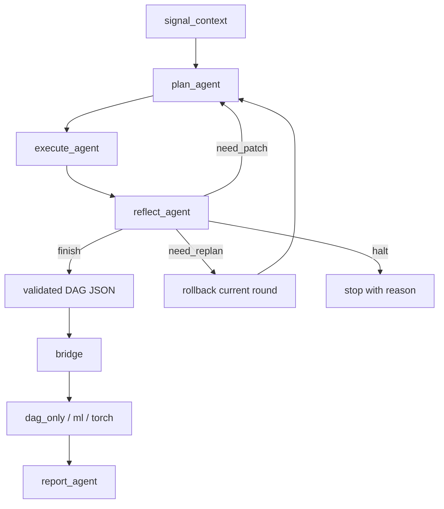

# 02 Workflow And Bridge

## 本文档解决什么问题

本文档冻结论文版前端主链：

- 四个主路径 agent 的输入、输出和禁止事项
- 多轮 `plan -> execute -> reflect -> replan` 状态机
- 为什么 `validated DAG JSON` 仍然是前后端唯一法定接口

## 当前主链

当前已成立的前端闭环是：

`signal_context -> StepPlan -> execute_agent -> validated DAG JSON -> reflect_agent -> report_agent`

它已经不再是旧平台里的字符串 plan + 自治 executor，而是合同驱动的前端链。

## 最终目标状态机



这里有两个关键设计：

- `need_patch`
  - 保留本轮新增节点和结果，继续下一轮 DAG 扩展
- `need_replan`
  - 回滚本轮新增节点和本轮新增 `execution_results`，恢复到 `last_stable_dag`

## graph path 的位置

`graph_path` 由 config/runtime 决定，不作为 `plan_agent` 的显式 prompt 输入。

它影响三件事：

- planner 的 artifact 倾向
- executor / bridge 的合法性约束
- report 的 graph-dependent section

但不改变 planner 的显式输入合同。

## 当前运行时合同类型

### `SignalContext`

planner 读取的是 prompt-safe 信号摘要，而不是完整窗口张量。

```python
class SignalContext:
    dataset_name: str
    channel_count: int
    window_shape: list[int]
    sampling_rate: int
    source_mode: str
    root_node_ids: list[str]
    representative_sample_id: str | None
```

如果当前 `dag_json` 为空，则 `root_node_ids` 就是初始多通道信号根。

### `StepPlan`

当前运行时主合同仍然是 NVTA 风格的结构化 step plan：

```python
class PlanStep:
    parent: str
    op_name: str
    params: dict[str, Any]

class StepPlan:
    plan: list[PlanStep]
```

### `ExecutionGap`

```python
class ExecutionGap:
    step_index: int
    parent: str
    op_name: str
    message: str
    recoverable: bool
```

语义：

- executor 不能静默跳过非法或无法执行的 step
- 缺口必须显式写进 state

### `ReflectionResult`

```python
class ReflectionResult:
    decision: Literal["finish", "need_patch", "need_replan", "halt"]
    reason: str
    missing_operators: list[str]
    shape_risks: list[str]
    structural_warnings: list[str]
```

### `RoundTrace`

```python
class RoundTrace:
    round_index: int
    input_dag_hash: str
    step_plan: StepPlan | None
    added_node_ids: list[str]
    execution_gaps: list[ExecutionGap]
    reflection_result: ReflectionResult | None
    rolled_back: bool
```

### `WorkflowState`

除了 `signal_context / step_plan / execution_results / dag` 外，当前还要显式跟踪：

- `iteration_index`
- `max_iterations`
- `round_history`
- `last_stable_dag`
- `last_stable_execution_results`

## 四个主路径 agent 的正式输入输出

### `plan_agent`

显式输入：

- `user_instruction`
- `signal_context`
- `dag_json`
- `reflection`

隐式上下文：

- `graph_path` from config/runtime
- `operator_catalog_summary`

输出：

- `StepPlan`

禁止事项：

- 不得发明 catalog 不存在的 `op_name`
- 不得越权改 training/model internals

### `execute_agent`

显式输入：

- `step_plan`
- `workflow_state`
- `operator_catalog`
- `signal_context`

输出：

- `validated DAG JSON`
- `execution_results` 写回 state
- `execution_gaps` 写回 state

必须遵守：

1. 只能消费 `StepPlan`
2. 不能新增计划外步骤
3. 参数补全顺序固定为：
   - `StepPlan.params`
   - state / signal-context derived values
   - operator schema defaults
   - LLM 对 `llm_tunable_params` 做补全或优化
4. 无法执行时必须写 `ExecutionGap`

### `reflect_agent`

输入：

- `instruction`
- `stage`
- `dag_blueprint`
- `issues_summary`
- `min_depth`
- `min_width`
- `max_depth`
- `current_depth`
- `execution_gaps`

输出：

- `ReflectionResult`

### `report_agent`

核心输入：

- `instruction`
- `graph_path`
- `compiled_manifest`
- `path_artifacts`
- `reflection_summary`

辅输入：

- `review_context`

输出：

- `report_markdown`

## data / model 子能力的位置

以下旧额外 agents 已经重组，不再进入 workflow 主路径：

- `src/data/dataset_preparer.py`
  - 负责从 split records / materialized features 构建 dataset views
- `src/model/shallow_ml.py`
  - 负责 `ml` path 的 shallow baselines
- `src/model/inquirer.py`
  - 负责 optional similarity artifacts

它们是主链调用的子能力，不是状态迁移节点。

## 当前 bridge 边界

bridge 仍然只吃 `validated DAG JSON`。

前端和后端之间的法定边界仍是：

`WorkflowState -> validated DAG JSON -> compile_dag_for_path()`

不允许：

- 直接把 workflow state 塞给 training
- 直接把 prompt 输出塞给 training
- 绕过 DAG 校验

## 当前已闭合链路

- `plan_agent` 已能从 preview signal 构建 `SignalContext` 并输出 `StepPlan`
- `execute_agent` 已能 materialize 单输入链和最小 `multi.concatenate`
- `reflect_agent` 已能输出结构化 `ReflectionResult`
- `report_agent` 已能消费 manifest + path artifacts + review context

## 当前未闭合但已明确的边界

- 仍是 representative / preview 级前端执行，不是 dataset-level 全窗口 DAG 执行
- `decision` 仍是 auxiliary terminal
- bridge 对 multi-parent lineage 仍是最小支持，不是完整 rich DAG compiler
- report 已可生成，但仍建立在 path artifacts 先准备好的前提上
