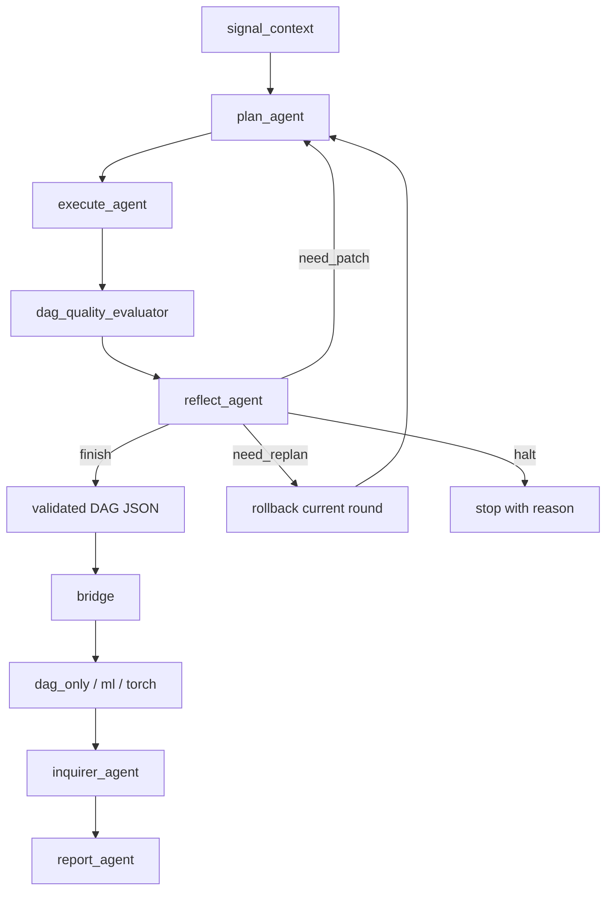

# 02 Workflow And Bridge

## 本文档解决什么问题

本文档冻结论文版前端主链：

- 四个主路径 agent 的输入、输出和禁止事项
- 多轮 `plan -> execute -> reflect -> replan` 状态机
- 为什么 `validated DAG JSON` 仍然是前后端唯一法定接口

## 当前主链

当前已成立的前端闭环是：

`PHMState -> StateGraph(plan -> execute -> dag_quality -> reflect -> rollback|compile_ready) -> validated DAG JSON -> bridge -> inquirer_agent -> report_agent`

它已经不再是旧平台里的字符串 plan + 自治 executor，而是合同驱动的前端链。

当前前端已经能够生成 richer 方法链，而不再局限于 `normalize -> fft -> rms` 这种最小模板。第一轮 enriched DAG 已经允许同时出现：

- `EXPAND` 分支
- `TRANSFORM -> AGGREGATE` 分支
- `MULTI_VARIABLE` 节点
- `DECISION` terminal side-output

并行还保留一条更轻的 proving lane，由 `runtime.workflow_mode=supervisor_proving` 激活：

`PHMState -> StateGraph(plan -> execute -> compile -> verify) -> validated DAG JSON -> bridge -> ml artifacts`

这条 proving lane 只服务最小存在性证明：

- planner 只看 strict deterministic operator subset
- execute 不再二次向 LLM 求参
- 不经过 `dag_quality_evaluator / reflect_agent / rollback / inquirer_agent / report_agent`
- 最终报告改由 deterministic `build_final_report()` 生成
- 成功定义收敛到最小 artifact contract，而不是 richer comparison logic

为了先验证更接近 `C_Agent/PHMGA` 的简单范式，当前还并行保留一条 `runtime.workflow_mode=simple_fullchain`：

`PHMState -> StateGraph(plan -> execute -> reflect -> compile -> inquirer -> report) -> validated DAG JSON -> bridge -> ml artifacts`

这条 simple lane 的目标不是论文 richer gate，而是先证明：

- `plan -> execute -> reflect` 能形成一个更轻的 supervisor-style loop
- 不经过 `dag_quality_evaluator`
- 不使用 `rollback`
- 仍然走正式 `validated DAG JSON -> compile_dag_for_path()` bridge 边界
- 最终报告也由 deterministic `build_final_report()` 生成，避免末端再次被 LLM 卡住

## 最终目标状态机



这里有两个关键设计：

- `need_patch`
  - 保留本轮新增节点和结果，继续下一轮 DAG 扩展
- `need_replan`
  - 回滚本轮新增节点和本轮新增 `execution_results`，恢复到 `last_stable_dag`

当前这一套状态机已经由 LangGraph 显式承载，不再由脚本循环隐式维护。

当前 agent 调用风格也已经统一为参考仓库式的 `ChatPromptTemplate | llm`。但 provider transport、OpenRouter capability routing、以及 StepFun 的 text/json structured fallback 仍只允许集中在 `src/llm/client.py`，不能在 graph node 内重复实现。

## graph path 的位置

`graph_path` 由 Hydra root config/runtime 决定，不作为 `plan_agent` 的显式 prompt 输入。

它影响三件事：

- planner 的 artifact 倾向
- executor / bridge 的合法性约束
- report 的 graph-dependent section

但不改变 planner 的显式输入合同。

## `workflow_mode` 的位置

当前运行时存在两个前端模式：

- `runtime.workflow_mode=rich`
  - 默认论文主链
  - 走 `plan -> execute -> dag_quality -> reflect -> rollback|compile_ready`
- `runtime.workflow_mode=simple_fullchain`
  - 更轻的 C_Agent-style 全链路
  - 走 `plan -> execute -> reflect -> compile -> inquirer -> report`
- `runtime.workflow_mode=supervisor_proving`
  - 轻量 proving lane
  - 走 `plan -> execute -> compile -> verify`

两者共享同一个入口：

`python main.py +runs=<preset>`

也共享同一个法定 bridge 边界：

`validated DAG JSON -> compile_dag_for_path()`

区别只在于前端是否启用 richer quality / reflection 闭环。

## DAG、bridge 与 path compilation 的分工

这里必须严格区分三层：

- `validated DAG JSON`
  - 表达方法结构、节点依赖与节点合同
  - 冻结 `node_id / op_uid / parents / input_bindings / shape / legal_paths`
  - 不表达 path-specific 的最终输出选择
- `bridge compiled plan`
  - 负责把统一 DAG 合同翻译成某个 graph path 的后端执行合同
  - 当前 `dag_only` 已稳定；`ml / torch` 已切到 compiled subgraph + output policy 合同
- `path runner`
  - 负责执行 compiled plan 并写出 path-specific artifacts

因此：

- `plan_agent` 只负责生成方法 DAG，不负责决定哪些节点进入 `ml / torch` 的最终特征矩阵
- output policy 与 compiled output 选择发生在 `bridge / dataset_preparer / path runner`
- 这些问题不属于 `plan_agent` 的职责

## `compiled subgraph` 与 `compiled output feature`

bridge 当前已经开始显式区分两个概念：

- `compiled subgraph`
  - 为某个 graph path 选出的最小可执行子图
  - 回答“为了得到后端要用的结果，哪些节点必须执行”
- `compiled output feature`
  - `compiled subgraph` 执行完后真正进入 `X` 的输出节点
  - 当前目标允许来自 `feature | multi`

这两个概念不能继续被旧 `FeatureSpec` 混成一层。原因是：

- single-parent 场景里，一个最终输出常常刚好等于一个 `feature` 节点
- multi-parent 场景里，最终输出可能来自：
  - `multi.concatenate`
  - `multi.cross_correlation`
- `decision` 节点虽然可执行，但仍只做 terminal side-output，不进入训练张量主链

最小例子：

```text
ch1 -> normalize -> rms ----\
                              -> concatenate
ch2 -> normalize -> rms ----/
```

这里：

- `compiled subgraph`
  - `ch1`
  - `normalize(ch1)`
  - `rms(ch1)`
  - `ch2`
  - `normalize(ch2)`
  - `rms(ch2)`
  - `concatenate`
- `compiled output feature`
  - `concatenate`

也就是说，bridge 需要同时回答“整段怎么执行”和“最后取什么作为输出”，而不是只回答“哪个 `feature` 节点存在”。

## 当前运行时合同类型

### `SignalContext`

planner 读取的是 prompt-safe 信号摘要，而不是完整窗口张量。

```python
class SignalContext:
    dataset_name: str
    channel_count: int
    window_shape: list[int]
    sampling_rate: int
    source_mode: str
    root_node_ids: list[str]
    representative_sample_id: str | None
```

如果当前 `dag_json` 为空，则 `root_node_ids` 就是初始多通道信号根。

### `StepPlan`

当前运行时主合同仍然是 NVTA 风格的结构化 step plan：

```python
class PlanStep:
    parent: str
    op_name: str
    params: dict[str, Any]

class StepPlan:
    plan: list[PlanStep]
```

### `ExecutionGap`

```python
class ExecutionGap:
    step_index: int
    parent: str
    op_name: str
    message: str
    recoverable: bool
```

语义：

- executor 不能静默跳过非法或无法执行的 step
- 缺口必须显式写进 state

### `DagQualitySummary`

`dag_quality_evaluator` 位于 `execute_agent` 和 `reflect_agent` 之间。它不是第五个主路径 agent，而是一个紧凑的当前轮质量摘要函数。

```python
class DagQualitySummary:
    current_depth: int
    min_depth: int
    max_depth: int
    depth_ok: bool

    feature_node_count: int
    multi_node_count: int
    operator_categories: list[str]

    execution_gap_count: int
    nan_ratio: float
    zero_variance_ratio: float

    proxy_probe_enabled: bool
    proxy_probe_macro_f1: float | None

    issues: list[str]
    recommendation_hint: Literal["finish_candidate", "patch_candidate", "replan_candidate", "halt_candidate"]
```

语义：

- 它只总结当前 round 的结构状态和小样本代理证据
- `min_depth` 继续存在，但只作为软约束，不再单独决定 `finish`
- `proxy_probe_macro_f1` 只在启用 proxy probe 时出现
- `recommendation_hint` 只是 reflect 的候选信号，不替代最终 `ReflectionResult`

### `ReflectionResult`

```python
class ReflectionResult:
    decision: Literal["finish", "need_patch", "need_replan", "halt"]
    reason: str
    missing_operators: list[str]
    shape_risks: list[str]
    structural_warnings: list[str]
```

### `RoundTrace`

```python
class RoundTrace:
    round_index: int
    input_dag_hash: str
    step_plan: StepPlan | None
    added_node_ids: list[str]
    execution_gaps: list[ExecutionGap]
    reflection_result: ReflectionResult | None
    rolled_back: bool
```

### `PHMState`

当前前端总状态已按参考仓库风格回迁为 `PHMState`，但仍承载论文版的现有字段语义：

- `last_stable_dag`
- `last_stable_execution_results`
- `round_history`
- `dag_quality_summary`
- `execution_gaps`
- `artifact_index`
- `graph_path`
- `signal_context`

同时显式持有：

- `DAGState`
- LangGraph round metadata
- downstream `path_artifacts`
- `final_report`

除了 `signal_context / step_plan / execution_results / dag` 外，当前还要显式跟踪：

- `iteration_index`
- `max_iterations`
- `round_history`
- `last_stable_dag`
- `last_stable_execution_results`
- `dag_quality_summary`

运行时 artifact 约束：

- 完整 artifact 索引只写入 `artifact_index.json`
- `workflow_state.json` 只保存状态快照与 `artifact_index_path`

## 四个主路径 agent 的正式输入输出

### `plan_agent`

显式输入：

- `user_instruction`
- `signal_context`
- `dag_json`
- `reflection`

隐式上下文：

- `graph_path` from config/runtime
- `operator_catalog_summary`

输出：

- `StepPlan`

禁止事项：

- 不得发明 catalog 不存在的 `op_name`
- 不得越权改 training/model internals

### `execute_agent`

显式输入：

- `step_plan`
- `workflow_state`
- `operator_catalog`
- `signal_context`

输出：

- `validated DAG JSON`
- `execution_results` 写回 state
- `execution_gaps` 写回 state

必须遵守：

1. 只能消费 `StepPlan`
2. 不能新增计划外步骤
3. 必须先按 richer operator schema 校验：
   - `input_spec`
   - `output_spec`
   - `rank_class`
4. 参数补全顺序固定为：
   - `StepPlan.params`
   - state / signal-context derived values
   - operator schema defaults
   - 仅当仍有缺失的 `llm_tunable_params` 时，LLM 才做补全或优化
5. 无法执行时必须写 `ExecutionGap`

当前额外边界：

- `EXPAND` 已可执行，并仍通过 `kind="transform"` 进入当前 bridge 的单父链 transform lineage
- `MULTI_VARIABLE` 已可执行至少两类节点：`concatenate` 与 `cross_correlation`
- `DECISION` 已进入半执行态：
  - 允许生成 terminal node
  - 允许写出 side-output result
  - 允许进入 manifest 与 report
  - 不允许进入 `ml / torch` 的训练张量主链

这里需要强调：

- `execute_agent` 负责把 richer DAG 正确 materialize 出来
- 它不负责把 multi-parent 节点编译成 `ml / torch` 的最终输出
- `concatenate`、`cross_correlation` 是否进入后端训练特征，是 bridge/path compilation 的问题

### `reflect_agent`

输入：

- `instruction`
- `stage`
- `dag_blueprint`
- `issues_summary`
- `min_depth`
- `min_width`
- `max_depth`
- `current_depth`
- `execution_gaps`
- `dag_quality_summary`

输出：

- `ReflectionResult`

当前 decision 规则：

- 有致命 gap 或 evaluator 判定当前 round 不可接受时，返回 `need_replan` 或 `halt`
- 无致命 gap，但 `depth_ok=False` 或质量偏弱时，返回 `need_patch`
- 结构健康且 `dag_quality_summary` 达标时，返回 `finish`

### `report_agent`

核心输入：

- `instruction`
- `graph_path`
- `compiled_manifest`
- `path_artifacts`
- `reflection_summary`
- `dag_quality_summary`

辅输入：

- `review_context`

输出：

- `report_markdown`

## data / model 子能力的位置

以下旧额外 agents 已经重组，不再进入 workflow 主路径：

- `src/data/dataset_preparer.py`
  - 负责从 split records / materialized features 构建 dataset views
- `src/model/shallow_ml.py`
  - 负责 `ml` path 的 shallow baselines
- `src/model/inquirer.py`
  - 负责 optional similarity artifacts

它们是主链调用的子能力，不是状态迁移节点。

## `dag_quality_evaluator` 的位置

`dag_quality_evaluator` 固定放在 `src/evaluation/dag_quality.py`，由 LangGraph 前端在 `execute_agent` 之后、`reflect_agent` 之前调用。

它的责任只有三件事：

- 读取当前 DAG、当前 round 的 `execution_results` 和 `execution_gaps`
- 生成一个最小 `DagQualitySummary`
- 把这个摘要提供给 `reflect_agent` 和 `report_agent`

它不做的事：

- 不直接改 DAG
- 不直接决定最终 reflection decision
- 不绕过 bridge 生成后端 artifacts

## 当前 bridge 边界

bridge 仍然只吃 `validated DAG JSON`。

前端和后端之间的法定边界仍是：

`PHMState -> validated DAG JSON -> compile_dag_for_path()`

不允许：

- 直接把 workflow state 塞给 training
- 直接把 prompt 输出塞给 training
- 绕过 DAG 校验

当前 bridge 对 `ml / torch` 已切到：

- `execution_nodes`
- `output_specs`
- `output_policy`

也就是说：

- compiled plan 已不再只等价于“一个 input channel + 一串 transform + 一个 `feature` 节点”
- `multi.concatenate`
- `multi.cross_correlation`

都已经可以进入 compiled output feature。

当前下一阶段 bridge/runtime 的正式目标转为：

- 稳住 output policy 与 compiled runtime contract
- 保持 `decision` 继续作为 side-output，而不是训练张量主链的一部分
- 后续再把 torch runtime 过渡到 `GraphModule / module factory`

## 当前已闭合链路

- `plan_agent` 已能从 preview signal 构建 `SignalContext` 并输出 `StepPlan`
- `execute_agent` 已能 materialize 单输入链和最小 `multi.concatenate`
- `dag_quality_evaluator` 已能输出紧凑的结构 + 代理证据摘要
- `reflect_agent` 已能输出结构化 `ReflectionResult`
- `report_agent` 已能消费 manifest + path artifacts + review context

## 当前未闭合但已明确的边界

- 当前前端执行仍是 representative / preview 级，不是 dataset-level 全窗口 DAG 执行
- `decision` 仍是 auxiliary terminal，不进入训练张量主链
- `dag_quality_evaluator` 只做当前 round 摘要，不做平台式多页评分系统
- compiled runtime 已支持当前 multi-parent 输出策略，但 richer `GraphModule` / learnable control 仍未接入
- report 已可生成，但仍建立在 path artifacts 先准备好的前提上
