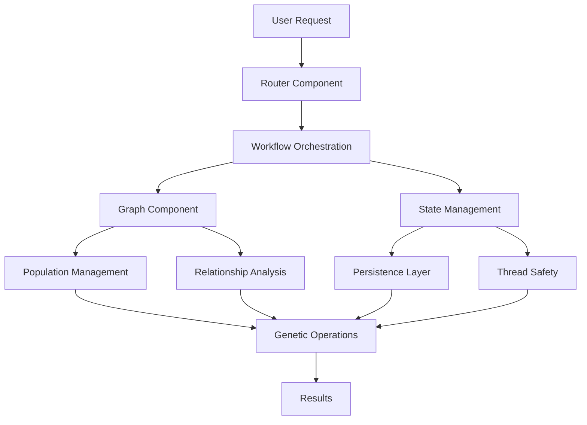

# Part 2: Core Components Architecture

**Estimated Time**: 4-5 hours  
**Prerequisites**: Completion of Part 1, basic understanding of graph theory  
**Difficulty**: Intermediate

## 🎯 Learning Objectives

By the end of this tutorial, you will:

1. Understand the PHMGA core architectural components
2. Implement a Router Component for workflow orchestration
3. Create a Graph Component for population structures and relationships
4. Design a State Management system with persistence and thread safety
5. Master integration patterns for combining components effectively
6. Build production-ready, modular components

## 📋 Overview

This tutorial focuses on the three core architectural components that form the backbone of the PHMGA framework:

1. **Router Component**: Manages request routing and workflow orchestration
2. **Graph Component**: Handles population structures, relationships, and graph algorithms
3. **State Management**: Provides persistence, thread safety, and state validation

Each component is designed to be:
- **Modular**: Can be used independently or combined
- **Extensible**: Easy to add new features and capabilities
- **Production-ready**: Includes error handling, logging, and monitoring
- **Well-tested**: Comprehensive unit and integration tests

## 🏗️ Architecture Overview



## 📚 Tutorial Structure

### Section 2.1: Router Component
**Estimated Time**: 1-1.5 hours

**Objectives**:
- Understand request routing concepts
- Implement multiple routing strategies
- Add async/await support for concurrent operations
- Create comprehensive error handling
- Build configuration management system

**Key Features**:
- Round-robin, weighted, and priority-based routing
- Async request processing
- Circuit breaker pattern for fault tolerance
- Metrics collection and monitoring
- YAML/JSON configuration support

### Section 2.2: Graph Component
**Estimated Time**: 1.5-2 hours

**Objectives**:
- Design graph structures for GA populations
- Implement graph algorithms for analysis
- Create visualization capabilities
- Build relationship management systems
- Add performance optimization

**Key Features**:
- NetworkX-based or custom graph implementation
- Support for directed and undirected graphs
- Node attributes for genetic information
- Edge weights for relationship strengths
- Graph algorithms (clustering, centrality, pathfinding)
- Interactive visualizations with matplotlib/plotly

### Section 2.3: State Management
**Estimated Time**: 1-1.5 hours

**Objectives**:
- Implement thread-safe state operations
- Create serialization and persistence systems
- Build state versioning and rollback
- Add checkpoint and resume functionality
- Design validation schemas

**Key Features**:
- Thread-safe operations using locks/async primitives
- Multiple serialization formats (pickle, JSON, HDF5)
- State versioning with rollback capabilities
- Database integration (SQLite, PostgreSQL)
- Schema validation and migration support

### Section 2.4: Integration Patterns
**Estimated Time**: 1 hour

**Objectives**:
- Combine components effectively
- Implement common integration patterns
- Create example applications
- Build testing strategies
- Design deployment configurations

**Key Features**:
- Component composition patterns
- Event-driven architectures
- Microservice integration
- Testing frameworks
- Docker containerization

## 🛠️ Setup Instructions

### Prerequisites

Ensure you have completed Part 1 and have the basic environment set up.

Additional requirements for Part 2:
```bash
# Install additional dependencies
pip install networkx plotly dash
pip install sqlalchemy alembic  # For database integration
pip install redis  # For distributed state management (optional)
pip install prometheus-client  # For metrics collection
```

### Project Structure

```
tutorials/part2/
├── README.md
├── router/
│   ├── __init__.py
│   ├── base_router.py
│   ├── strategies.py
│   ├── async_router.py
│   ├── config.py
│   └── tests/
├── graph/
│   ├── __init__.py
│   ├── population_graph.py
│   ├── algorithms.py
│   ├── visualization.py
│   └── tests/
├── state/
│   ├── __init__.py
│   ├── state_manager.py
│   ├── persistence.py
│   ├── validation.py
│   └── tests/
├── integration/
│   ├── __init__.py
│   ├── patterns.py
│   ├── examples.py
│   └── tests/
├── config/
│   ├── router_config.yaml
│   ├── graph_config.yaml
│   └── state_config.yaml
└── examples/
    ├── basic_integration.py
    ├── advanced_workflow.py
    └── production_example.py
```

## 🎓 Learning Path

### For Beginners (New to Architecture)
1. Start with Section 2.1 (Router Component)
2. Focus on understanding the basic concepts
3. Complete all hands-on exercises
4. Use the provided templates and examples
5. Ask questions in the community discussions

### For Intermediate Developers
1. Review the architecture overview quickly
2. Implement components with your own variations
3. Focus on the integration patterns in Section 2.4
4. Try the advanced exercises and challenges
5. Contribute improvements to the codebase

### For Advanced Developers
1. Skim the basic implementations
2. Focus on performance optimization and scalability
3. Implement additional features and extensions
4. Design your own integration patterns
5. Mentor other learners in the community

## 📊 Assessment Criteria

### Knowledge Checks
- [ ] Understand routing strategies and their trade-offs
- [ ] Can explain graph algorithms and their applications
- [ ] Know state management patterns and best practices
- [ ] Understand integration patterns and when to use them

### Practical Exercises
- [ ] Implement a custom routing strategy
- [ ] Create a graph algorithm for population analysis
- [ ] Build a state persistence system
- [ ] Design an integration pattern for a specific use case

### Project Assignments
- [ ] Build a complete workflow using all three components
- [ ] Create a monitoring and metrics system
- [ ] Implement a distributed state management solution
- [ ] Design a production deployment strategy

## 🔗 Resources

### Documentation
- [NetworkX Documentation](https://networkx.org/documentation/stable/)
- [SQLAlchemy ORM Tutorial](https://docs.sqlalchemy.org/en/14/orm/tutorial.html)
- [Async/Await in Python](https://docs.python.org/3/library/asyncio.html)

### Design Patterns
- [Enterprise Integration Patterns](https://www.enterpriseintegrationpatterns.com/)
- [Microservices Patterns](https://microservices.io/patterns/)
- [Event-Driven Architecture](https://martinfowler.com/articles/201701-event-driven.html)

### Performance and Scalability
- [Python Performance Tips](https://wiki.python.org/moin/PythonSpeed/PerformanceTips)
- [Distributed Systems Concepts](https://www.distributed-systems.net/)
- [Database Performance Tuning](https://use-the-index-luke.com/)

## 🚀 Getting Started

Ready to dive into the core components? Let's start with the Router Component:

**Next**: [Section 2.1 - Router Component](2.1-router-component.md)

## 🤝 Community Support

- **GitHub Discussions**: Ask questions about architecture decisions
- **Code Reviews**: Share your implementations for feedback
- **Study Groups**: Form groups to work through complex topics together
- **Office Hours**: Join weekly architecture Q&A sessions

## 📈 Success Metrics

By the end of Part 2, you should be able to:

1. **Design** modular, extensible components
2. **Implement** production-ready systems with proper error handling
3. **Integrate** multiple components into cohesive workflows
4. **Test** components thoroughly with unit and integration tests
5. **Deploy** systems with monitoring and observability
6. **Scale** components for production workloads

---

**Ready to build the core architecture?** Let's start with [Router Component Implementation](2.1-router-component.md)!
