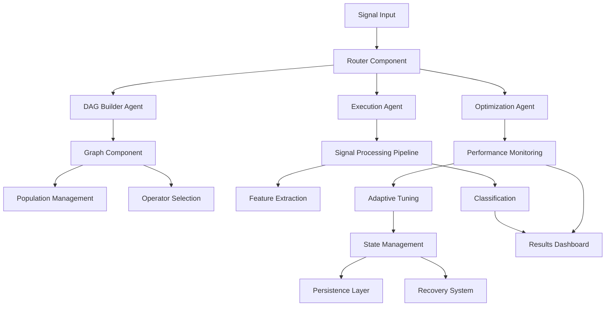

# Part 3: Advanced Integration and Real-World Applications

**Estimated Time**: 6-8 hours  
**Prerequisites**: Completion of Parts 1-2, signal processing basics  
**Difficulty**: Advanced

## 🎯 Learning Objectives

By the end of this tutorial, you will:

1. Build enhanced Case 1 implementation using unified PHMGA architecture
2. Create autonomous signal processing DAGs with self-optimization
3. Deploy production-ready systems with monitoring and scaling
4. Develop custom operators for domain-specific applications
5. Implement real-time processing pipelines
6. Master advanced integration patterns and best practices

## 📋 Overview

This advanced tutorial demonstrates the full power of the PHMGA framework through two comprehensive case studies:

### Case 1: Enhanced System Integration
Building upon the existing bearing fault diagnosis case, we'll create a unified architecture that combines:
- Router Component for workflow orchestration
- Graph Component for population management
- State Management for persistence and recovery
- Real-time monitoring dashboard
- Production deployment configurations

### Case 2: Autonomous Signal Processing DAG
A self-optimizing signal processing pipeline that:
- Automatically discovers optimal processing sequences
- Adapts to different signal characteristics
- Supports multiple signal types (time-series, frequency domain, spectrograms)
- Provides generalization framework for new domains

## 🏗️ Architecture Overview



## 📚 Tutorial Structure

### Section 3.1: Enhanced Case 1 Implementation
**Estimated Time**: 3-4 hours

**Objectives**:
- Integrate all PHMGA components into unified system
- Implement real-time monitoring and alerting
- Create production deployment configurations
- Add advanced error handling and recovery

### Section 3.2: Autonomous Signal Processing DAG
**Estimated Time**: 2-3 hours

**Objectives**:
- Build self-optimizing processing pipelines
- Implement adaptive algorithm selection
- Create generalization framework
- Support multiple signal modalities

### Section 3.3: Production Deployment
**Estimated Time**: 1-2 hours

**Objectives**:
- Docker containerization strategies
- Kubernetes orchestration
- Monitoring and observability
- Scaling and performance optimization

## 🛠️ Setup Instructions

### Additional Dependencies

```bash
# Advanced signal processing
pip install scipy scikit-image librosa
pip install plotly dash streamlit  # For dashboards
pip install docker kubernetes  # For deployment
pip install prometheus-client grafana-api  # For monitoring
pip install celery redis  # For distributed processing
```

### Project Structure

```
tutorials/part3/
├── README.md
├── case1_enhanced/
│   ├── __init__.py
│   ├── unified_system.py
│   ├── monitoring.py
│   ├── deployment/
│   └── tests/
├── autonomous_dag/
│   ├── __init__.py
│   ├── dag_builder.py
│   ├── adaptive_processor.py
│   ├── signal_types.py
│   └── tests/
├── production/
│   ├── docker/
│   ├── kubernetes/
│   ├── monitoring/
│   └── scaling/
└── examples/
    ├── real_time_processing.py
    ├── multi_modal_analysis.py
    └── production_deployment.py
```

## 🎓 Learning Path

### For Advanced Practitioners
1. Focus on architectural patterns and integration strategies
2. Implement custom extensions and optimizations
3. Design production deployment strategies
4. Contribute to framework development

### For Industry Applications
1. Adapt examples to specific domain requirements
2. Implement custom signal processing operators
3. Design monitoring and alerting systems
4. Scale for production workloads

### For Research Applications
1. Extend algorithms with novel approaches
2. Implement experimental features
3. Contribute to academic publications
4. Collaborate on open-source development

## 📊 Success Metrics

By completion, you should achieve:

1. **System Integration**: Successfully combine all PHMGA components
2. **Performance Optimization**: Achieve production-level performance
3. **Deployment Readiness**: Deploy scalable, monitored systems
4. **Custom Development**: Create domain-specific extensions
5. **Real-World Application**: Apply to actual industrial problems

## 🔗 Prerequisites Review

Before starting Part 3, ensure you have:

- [ ] Completed Parts 1 and 2 successfully
- [ ] Understanding of signal processing fundamentals
- [ ] Basic knowledge of containerization (Docker)
- [ ] Familiarity with monitoring and observability concepts
- [ ] Access to computational resources for testing

## 🚀 Getting Started

Ready to build production-ready PHMGA systems? Let's start with the enhanced Case 1 implementation:

**Next**: [Section 3.1 - Enhanced Case 1 Implementation](3.1-enhanced-case1.md)

---

**Note**: This tutorial represents the culmination of the PHMGA learning journey. Take your time to understand each concept thoroughly, as these patterns will be essential for real-world applications.
