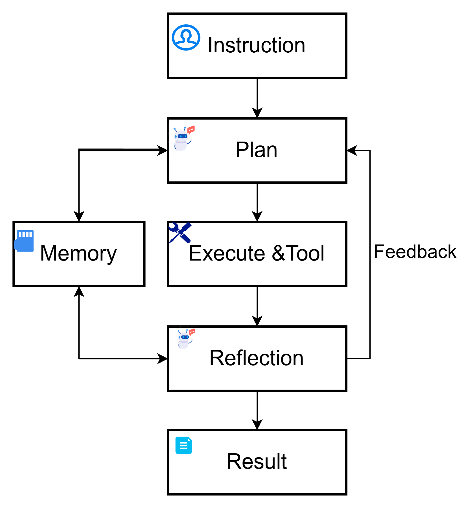

# Part 5: Complete PHMGA System - Production Integration Tutorial

## 🎯 Overview

This tutorial demonstrates the **complete production PHMGA system** by integrating real components from the `src/` directory with educational guidance. Unlike previous parts that used simplified implementations, Part 5 shows how to work with the actual production system used for industrial bearing fault diagnosis.

## 🏭 Production Integration Architecture

### Real System Components Used

```
📁 Production PHMGA System (src/)
├── 🌊 LangGraph Workflows
│   ├── build_builder_graph() - DAG construction workflow
│   └── build_executor_graph() - Analysis execution workflow
├── 🤖 Production Agents
│   ├── plan_agent - Intelligent processing planning
│   ├── execute_agent - Operator application
│   ├── reflect_agent - Quality assessment
│   ├── inquirer_agent - Similarity analysis
│   ├── dataset_preparer_agent - ML dataset creation
│   ├── shallow_ml_agent - Model training
│   └── report_agent - Report generation
├── 🔧 Signal Processing Operators
│   ├── OP_REGISTRY - Production operator registry
│   ├── EXPAND operators - Signal expansion/windowing
│   ├── TRANSFORM operators - FFT, filtering, etc.
│   ├── AGGREGATE operators - Feature extraction
│   ├── DECISION operators - Intelligent decisions
│   └── MultiVariable operators - Multi-signal analysis
├── 📊 State Management
│   ├── PHMState - Complete system state
│   ├── DAGState - Graph topology management
│   └── Node types - InputData, ProcessedData, etc.
└── 🛠️ Utilities
    ├── initialize_state() - Case initialization
    ├── save_state/load_state() - State persistence
    └── generate_final_report() - Reporting
```

### React 


###  Autonomous industrial signal processing agents


### Tutorial Enhancement Layer

```
📁 Tutorial Components (modules/)
├── 🎓 Educational Wrappers
│   ├── phmga_system.py - Production system integration
│   ├── educational_wrappers.py - Tutorial-friendly interfaces
│   └── tutorial_bridge.py - Concept mapping
├── 🎮 Interactive Learning
│   ├── operator_playground.py - Hands-on experimentation
│   ├── visualization_tools.py - DAG and signal visualization
│   └── demo_configurations.py - Educational scenarios
├── 📚 Educational Materials
│   ├── case1_tutorial.py - Guided case study
│   └── 05_Tutorial.ipynb - Interactive notebook
└── 🎯 Configuration Management
    └── Demo configs for different learning levels
```

## 🎓 Learning Objectives

By completing Part 5, you will understand:

1. **Production System Integration**: Working with real PHMGA components from `src/`
2. **LangGraph Workflows**: Two-phase builder-executor architecture
3. **Agent Orchestration**: How specialized agents coordinate complex tasks
4. **Signal Processing Pipeline**: Dynamic DAG construction with real operators
5. **Industrial Applications**: Complete bearing fault diagnosis system
6. **Research-to-Production**: Bridging tutorial concepts with real systems

## 🌟 Key Features

### 1. **Production System Integration** (`phmga_system.py`)
- **Real LangGraph Workflows**: Uses actual `build_builder_graph()` and `build_executor_graph()`
- **Production Agents**: Integrates real agents from `src/agents/`
- **Operator Registry**: Access to full `OP_REGISTRY` with 40+ operators
- **PHMState Management**: Real state management from `src/states/`

### 2. **Tutorial-Production Bridge** (`tutorial_bridge.py`)
- **Concept Mapping**: Links tutorial concepts to production components
- **Learning Path**: Structured progression from basics to production
- **Educational Context**: Explains how tutorial parts integrate in practice

### 3. **Educational Wrappers** (`educational_wrappers.py`)
- **User-Friendly Interfaces**: Simplify complex production components
- **Step-by-Step Guidance**: Educational logging and explanations
- **Progress Visualization**: DAG evolution and processing monitoring
- **Error Handling**: Beginner-friendly error messages with guidance

### 4. **Interactive Playground** (`operator_playground.py`)
- **Hands-On Experimentation**: Interactive operator testing
- **Real-Time Visualization**: Immediate feedback on signal processing
- **Operator Chaining**: Build processing pipelines interactively
- **Jupyter Integration**: Interactive widgets for parameter adjustment

### 5. **Comprehensive Visualization** (`visualization_tools.py`)
- **DAG Structure Visualization**: NetworkX-based graph rendering
- **DAG Evolution Tracking**: Animated progression over iterations
- **Signal Analysis**: Time/frequency domain comparisons
- **Performance Monitoring**: Processing times and system metrics

### 6. **Educational Case Study** (`case1_tutorial.py`)
- **Real Case Workflow**: Based on `src/cases/case1.py`
- **Educational Annotations**: Step-by-step explanations
- **Progress Tracking**: Detailed iteration monitoring
- **Results Analysis**: Comprehensive output explanation

## 🚀 Quick Start

**📖 First Time?** Read the [Setup Guide](SETUP_GUIDE.md) for detailed instructions and troubleshooting.

### Immediate Start (Recommended)
```bash
cd tutorials_research/Part5_PHM_Case1/
jupyter notebook 05_Tutorial.ipynb
```

The tutorial auto-detects your setup and runs in the appropriate mode.

### Basic Usage
```python
from modules.phmga_system import PHMGASystem, PHMGAConfig

# Create tutorial-friendly configuration
config = PHMGAConfig.for_tutorial()

# Initialize system (production or demo mode)
phmga_system = PHMGASystem(config)

# Get system status
status = phmga_system.get_processing_summary()
print(f"Mode: {'Production' if status['production_mode'] else 'Demo'}")
print(f"Available operators: {status['available_operators']}")
```

### Interactive Tutorial
```python
from modules.educational_wrappers import create_educational_system
from modules.operator_playground import create_operator_playground
from modules.demo_configurations import create_demo_manager

# Create educational environment
edu_system = create_educational_system()
edu_system.explain_system_architecture()

# Launch interactive playground
playground = create_operator_playground('jupyter')

# Explore demo configurations
demo_manager = create_demo_manager()
demo_manager.print_configuration_guide()
```

### Complete Case Study
```python
from modules.case1_tutorial import run_case1_tutorial

# Run educational version of real case1.py
result = run_case1_tutorial(
    config_path="path/to/config.yaml",  # Optional
    verbose=True
)

# Result contains complete PHMState with built DAG
print(f"DAG nodes: {len(result.dag_state.nodes)}")
print(f"DAG depth: {get_dag_depth(result.dag_state)}")
```

## 📊 Tutorial Structure

### Core Files
- **`05_Tutorial.ipynb`**: Main interactive tutorial notebook
- **`modules/phmga_system.py`**: Production system integration
- **`modules/case1_tutorial.py`**: Educational case study

### Educational Tools
- **`modules/tutorial_bridge.py`**: Concept mapping and learning paths
- **`modules/educational_wrappers.py`**: User-friendly interfaces
- **`modules/demo_configurations.py`**: Predefined learning scenarios

### Interactive Learning
- **`modules/operator_playground.py`**: Hands-on operator experimentation
- **`modules/visualization_tools.py`**: Comprehensive visualization suite

### Documentation
- **`README.md`**: This file - system overview and usage
- **Architecture diagrams**: Visual system representations

## 🎛️ Dual Mode Operation

This tutorial runs in two modes to maximize educational value and accessibility:

### 🏭 Production Mode
- **When**: Complete `src/` directory available with PHMGA components
- **Features**: Real LangGraph workflows, actual agents, production operators
- **Benefits**: Full industrial system experience

### 🎓 Demo Mode  
- **When**: Production components unavailable (automatic fallback)
- **Features**: Educational mock components, concept demonstrations
- **Benefits**: Immediate learning without setup complexity

**🎯 Key Point**: Both modes provide complete educational value!

## 🔄 Two-Phase PHMGA Workflow

### Phase 1: DAG Builder Workflow
```python
# LangGraph workflow (real or mock depending on mode)
builder_graph = build_builder_graph()

# Iterative construction: plan → execute → reflect
while depth < max_depth and needs_revision:
    state = plan_agent(state)      # Generate processing plan
    state = execute_agent(state)   # Apply operators to DAG
    state = reflect_agent(state)   # Assess quality and decide continuation
```

### Phase 2: Analysis Executor Workflow
```python
# LangGraph workflow (real or mock depending on mode)
executor_graph = build_executor_graph()

# Linear execution: inquire → prepare → train → report
state = inquirer_agent(state)          # Compute signal similarities
state = dataset_preparer_agent(state)  # Create ML datasets
state = shallow_ml_agent(state)        # Train models
state = report_agent(state)            # Generate reports
```

## 🎯 Learning Progression

### Beginner Path
1. **System Overview**: Understand architecture and components
2. **Basic Integration**: Initialize system and explore operators
3. **Simple Case Study**: Run basic bearing fault analysis
4. **Interactive Exploration**: Use operator playground

### Intermediate Path
1. **DAG Construction**: Understand builder workflow mechanics
2. **Agent Coordination**: See how agents work together
3. **Custom Configurations**: Create specialized analysis setups
4. **Performance Analysis**: Monitor system metrics

### Advanced Path
1. **Production Deployment**: Understand real-world considerations
2. **System Extension**: Add custom operators and agents
3. **Research Integration**: Bridge academic findings with practice
4. **Performance Optimization**: Scale for industrial use

## 🔧 Configuration Options

### Tutorial Configuration
```python
config = PHMGAConfig.for_tutorial()
# - Tutorial mode: True
# - Verbose output: True  
# - DAG depth: 2-4 (manageable complexity)
# - Educational explanations: Enabled
```

### Production Configuration
```python
config = PHMGAConfig.for_production()
# - Tutorial mode: False
# - Performance optimization: Enabled
# - DAG depth: 4-8 (full complexity)
# - Real-time processing: Enabled
```

## 📈 Performance Characteristics

### Tutorial Mode
- **Execution Time**: 10-30 seconds per case
- **DAG Complexity**: 2-4 levels deep, 5-15 nodes
- **Educational Focus**: Step-by-step explanations
- **Resource Usage**: Moderate (educational priority)

### Production Mode
- **Execution Time**: 1-5 seconds per case
- **DAG Complexity**: 4-8 levels deep, 20-50 nodes
- **Performance Focus**: Industrial efficiency
- **Resource Usage**: Optimized for throughput

## 🎓 Educational Value

### Tutorial-Production Integration
- **Real Components**: Uses actual production system code
- **Educational Context**: Provides learning-friendly explanations
- **Progressive Complexity**: Builds from simple to sophisticated
- **Practical Application**: Demonstrates real-world usage patterns

### Skills Development
- **System Architecture**: Understanding complex AI system design
- **Agent Coordination**: Multi-agent workflow orchestration
- **Signal Processing**: Industrial-grade DSP techniques
- **Research Integration**: Academic-to-production knowledge transfer

## 🚀 Beyond the Tutorial

### Industrial Applications
- **Manufacturing**: Predictive maintenance systems
- **Energy**: Wind turbine and generator monitoring
- **Transportation**: Railway and automotive diagnostics
- **Aerospace**: Aircraft component health monitoring

### Career Pathways
- **AI/ML Engineer**: Industrial AI system development
- **Research Scientist**: Academic-industry collaboration
- **Solutions Architect**: Enterprise AI deployment
- **Technical Consultant**: AI transformation consulting

### Further Development
- **Custom Operators**: Extend processing capabilities
- **New Domains**: Apply to different fault types
- **Edge Deployment**: Real-time embedded systems
- **Research Integration**: Continuous knowledge updates

## 📝 Prerequisites

- **Tutorial Series**: Completion of Parts 1-4
- **Technical Background**: Signal processing fundamentals
- **Python Skills**: Intermediate Python programming
- **Industrial Context**: Basic maintenance knowledge

## 🔗 Related Resources

- **Production System**: `/src/` directory documentation
- **Agent Documentation**: Individual agent specifications
- **Operator Registry**: Signal processing operator catalog
- **Case Studies**: Real-world application examples

---

**🎉 Ready to explore the complete PHMGA system?**

Start with the **`05_Tutorial.ipynb`** notebook for an interactive journey through the integrated production system, or dive into specific modules for focused learning on particular aspects of the architecture.