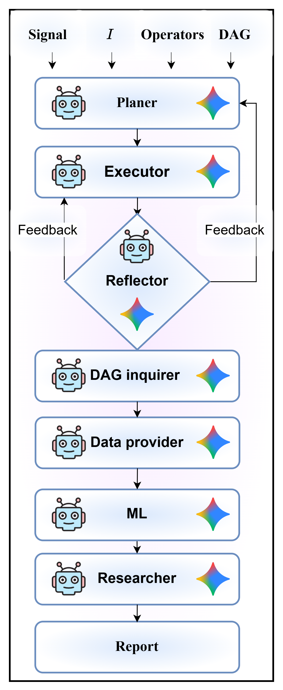
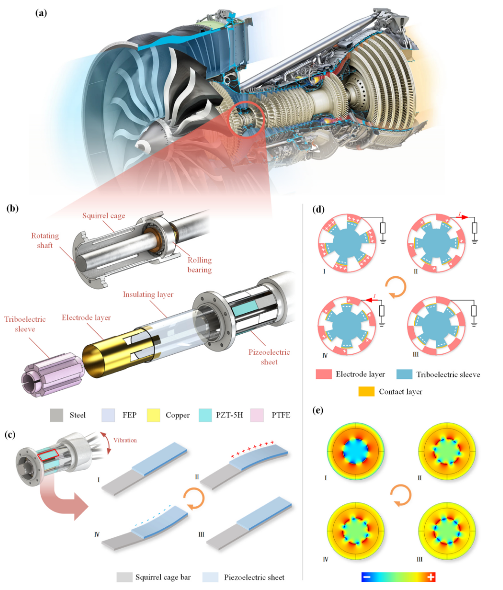
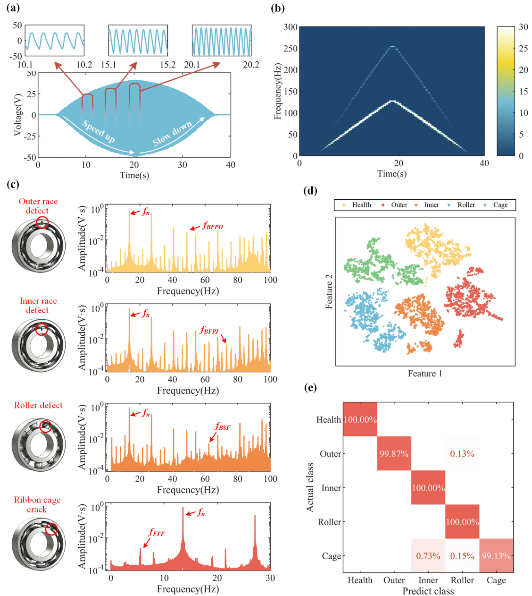

# Part 5: Complete PHMGA System - Production Integration Tutorial

<!-- ## 🎯 Overview

This tutorial demonstrates the **complete production PHMGA system** by integrating real components from the `src/` directory with educational guidance. Unlike previous parts that used simplified implementations, Part 5 shows how to work with the actual production system used for industrial bearing fault diagnosis.

## 🏭 Production Integration Architecture

### Real System Components Used

```
📁 Production PHMGA System (src/)
├── 🌊 LangGraph Workflows
│   ├── build_builder_graph() - DAG construction workflow
│   └── build_executor_graph() - Analysis execution workflow
├── 🤖 Production Agents
│   ├── plan_agent - Intelligent processing planning
│   ├── execute_agent - Operator application
│   ├── reflect_agent - Quality assessment
│   ├── inquirer_agent - Similarity analysis
│   ├── dataset_preparer_agent - ML dataset creation
│   ├── shallow_ml_agent - Model training
│   └── report_agent - Report generation
├── 🔧 Signal Processing Operators
│   ├── OP_REGISTRY - Production operator registry
│   ├── EXPAND operators - Signal expansion/windowing
│   ├── TRANSFORM operators - FFT, filtering, etc.
│   ├── AGGREGATE operators - Feature extraction
│   ├── DECISION operators - Intelligent decisions
│   └── MultiVariable operators - Multi-signal analysis
├── 📊 State Management
│   ├── PHMState - Complete system state
│   ├── DAGState - Graph topology management
│   └── Node types - InputData, ProcessedData, etc.
└── 🛠️ Utilities
    ├── initialize_state() - Case initialization
    ├── save_state/load_state() - State persistence
    └── generate_final_report() - Reporting
``` -->

## Abstract

Vibration signal analysis is a cornerstone of machine condition monitoring and fault diagnosis, yet it faces a central dilemma: traditional expert systems have rigid workflows, while end-to-end deep models, despite their adaptive learning abilities, suffer from being "black boxes" with insufficient reproducibility. This paper introduces a neuro-symbolic multi-agent framework for autonomous signal processing. The framework utilizes a Large Language Model (LLM) as a central decision-maker, coordinating a toolbox of interpretable, symbolic signal processing operators to enable autonomous vibration signal analysis and diagnosis. 

The framework adopts a Plan-Execute-Review multi-agent architecture to iteratively optimize signal processing decision chains. To ensure logical consistency of LLM planning and prevent incorrect operator calls, all operators are formally regulated based on their dimensional and semantic transformation properties. Specifically, operators are categorized into four types (dimension-increasing, dimension-preserving, dimension-reducing, and multi-signal) with semantic constraints for LLM comprehension.

Validation on bearing fault diagnosis datasets demonstrates that this framework can autonomously generate signal processing decision chains with clear physical meaning, successfully reproducing expert-level interpretable diagnostic algorithms such as "envelope spectrum-kurtosis." In single-domain tests on the Tsinghua University bearing dataset, the Gemini-2.5-pro version achieved 97.8% accuracy. In cross-domain tests on the University of Ottawa variable-speed dataset, training only on 'acceleration' and 'deceleration' conditions, the framework achieved 99.3% accuracy on unseen conditions, proving its generalization ability. This research provides a promising new paradigm for building trustworthy, reproducible, and scalable next-generation intelligent diagnostic systems.

## 1. Introduction

**Motivation.** Rotating machinery (bearings, gears) manifests early defects as pattern changes in vibration signals. Classic workflows—filtering, time/frequency transforms, feature engineering, classification—are *interpretable* but **expert‑crafted** and fragile under domain shift. Conversely, deep end‑to‑end models learn powerful representations but are **opaque**, difficult to audit, and may generalize poorly to OOD settings.

**Idea.** We seek a third way: combine **LLM‑level planning and reasoning** with **symbolic, physics‑grounded operators** to autonomously assemble *explainable* signal‑processing pipelines.

**Contributions.**

1. We **fuse an LLM agent** with a **neuro‑symbolically specified operator library**, bridging high‑level reasoning and precise numerical computation.
2. We propose a **multi‑agent loop**—**Planner, Executor, Reviewer**—that builds and refines a **Directed Acyclic Graph (DAG) ‑shaped decision chain** (nodes = operators, edges = dataflow) with transparent semantics.
3. We deliver **evidence** on two public bearing datasets, including **zero‑shot cross‑condition generalization** under variable speed.

**What’s new vs. expert systems / end‑to‑end DL / raw LLMs.** Our framework retains interpretability (like expert systems) but is *adaptive*; retains learning benefits (like DL) but is *auditable*; and anchors an LLM’s free‑form reasoning **to formal operator specs**, mitigating hallucination.

| Dimension | Our Framework | Expert Systems | Neural Networks | LLMs |
|-----------|--------------|----------------|-----------------|------|
| Autonomous Planning | ✓✓ | ✗ | ✓ | ✓ |
| Interpretability | ✓✓ | ✓✓ | ~ | ~ |
| Dynamic Adaptation | ✓✓ | ✗ | ✓ | ✓ |
| Domain Knowledge | ✓✓ | ✓✓ | ✗ | ✗ |
| Tool Usage | ✓✓ | / | / | ✗ |

Legend: ✓✓ (core strength), ✓ (capable), ~ (limited), ✗ (insufficient), / (not applicable)

## method

### React
<p align="center">
    
</p>


### 2.1 Neuro-Symbolic Specification of Signal Processing Operators

To enable LLMs to autonomously plan signal processing workflows and construct effective decision chains, the core challenge is to eliminate LLM "hallucinations" in tool usage and bridge the gap between LLM's powerful symbolic reasoning capabilities and precise numerical computations. We propose a Neuro-Symbolic Specification that formalizes signal processing algorithms as LLM-understandable and callable "operators."

Each signal processing step is abstracted as an operator Φ with parameters θ, which receives one or more signal tensors as input and outputs a new tensor:

$$\mathbf{Y} = \Phi(\mathbf{X}_1, \mathbf{X}_2, ...; \theta), \mathbf{X} \in \mathbb{C}^{B \times C \times D_m}$$

where B represents batch size, C is the number of channels, and D_m represents remaining dimensions.

Based on dimensional transformation characteristics, we categorize operators into four fundamental types:

**1. Dimension-Increasing Operators:** Transform input tensors to higher-dimensional spaces to reveal latent structures. For example, Short-Time Fourier Transform (STFT) maps 1D time-domain signals to 2D time-frequency representations.

**2. Dimension-Reducing Operators:** Compress input tensors through aggregation along axes to extract compact features. For example, statistical measures like mean or RMS along the time axis.

**3. Dimension-Preserving Operators:** Transform numerical values or semantics without changing tensor shape. For example, FFT changes the semantic meaning from time domain to frequency domain while preserving dimensions.

**4. Multi-Signal Operators:** Accept two or more independent signal tensors and output relationships between them. For example, coherence spectrum calculation between two channels.

### 2.2 Multi-Agent Architecture

The framework employs three core agents working in coordination:

#### 2.2.1 Planner Agent
The Planner serves as the cognitive core, responsible for task decomposition and strategy generation. It receives user-defined goals (e.g., "diagnose bearing faults"), analyzes the current DAG topology, and references historical feedback from the Reviewer. Its state transition function is:

$$P_t = \mathcal{A}_p(I, D_t, H_t)$$

where I is the task instruction, D_t is the current DAG, and H_t is the review history.

#### 2.2.2 Executor Agent
The Executor translates abstract plans into concrete numerical computations and DAG construction. It calls validated industrial-grade operators from the predefined library, updating the signal processing graph with new nodes or connections. Its state transition function is:

$$D_{t+1} = \mathcal{A}_e(D_t, P_t)$$

#### 2.2.3 Reviewer Agent
The Reviewer performs meta-cognitive evaluation after each execution cycle. It critically assesses the updated DAG for execution success, strategy effectiveness, feature redundancy, logical coherence, and alignment with the final goal. It generates structured feedback and determines whether further optimization is needed:

$$H_{t+1} = \mathcal{A}_r(I, D_{t+1}, H_t)$$

### 2.3 Problem Formulation: Optimizing Signal Processing Decision Chains

The core problem is formalized as: How can an intelligent system autonomously call operators from a given library to construct and optimize a signal processing decision chain for equipment fault diagnosis?

Given:
- Task instruction I (e.g., "diagnose bearing A faults")
- Operator library Φ containing atomic signal processing operators
- Signal dataset S, divided into training/validation S_train and test S_test
- Signal processing decision chain D as a DAG with topology D_topo and parameters Θ

The offline training phase seeks to learn an optimal decision chain D* that maximizes a utility function U:

$$D^*, \Theta^* = \arg\max_{D, \Theta} U(D(\Theta), S_{train}, I)$$


###  Autonomous industrial signal processing agents

<p align="center">
    
</p>


## 3. Experimental Validation

### 3.1 Datasets

**Dataset 1 (D1): Tsinghua University Bearing Dataset [17]**
- Steady-state conditions with five health states: healthy, inner race fault, outer race fault, rolling element fault, and cage crack
- Train/test split: 1:1 ratio with 5-fold cross-validation

**Rotor**


**Signal**



**Dataset 2 (D2): University of Ottawa Variable Speed Dataset [18]**
- Four time-varying speed conditions with three health states
- Cross-domain validation: Training on simple "acceleration" and "deceleration" conditions
- Testing on unseen complex patterns: "acceleration-then-deceleration" and "deceleration-then-acceleration"


### 3.2 Case Studies Configuration

Three validation cases were designed:
1. **Case 1:** D1 dataset with Gemini-2.0-flash model
2. **Case 2:** D1 dataset with Gemini-2.5-pro model
3. **Case 3:** D2 variable speed dataset with Gemini-2.5-pro model


### 3.3 Results and Analysis

#### 3.3.1 DAG Evolution Process

The system demonstrated sophisticated planning capabilities across all cases:

- **Case 1:** Generated a depth-4 DAG through 5 iterations, establishing parallel envelope analysis and FFT paths for dual channels, autonomously discovering "envelope spectrum-kurtosis" features

- **Case 2:** With the more capable Gemini-2.5-pro model, the system created more complex expert-level logic, including cross-channel correlation functions and STFT, precisely reproducing the golden standard "Hilbert envelope → FFT → spectral kurtosis/skewness" workflow

- **Case 3:** For variable speed conditions, the system adaptively explored both envelope analysis and wavelet transforms, incorporating cross-channel correlation analysis for robust feature extraction under non-stationary conditions

#### 3.3.2 Classification Performance

Using only Support Vector Machines as shallow classifiers to isolate the contribution of generated features:

**Table 1: Case 1 Performance (Gemini-2.0-flash)**
| Feature | Accuracy | F1 Score |
|---------|----------|----------|
| Best Individual (Φ3) | 0.872 | 0.857 |
| Ensemble Model | 0.872 | 0.857 |


**Table 2: Case 2 Performance (Gemini-2.5-pro)**
| Feature | Accuracy | F1 Score |
|---------|----------|----------|
| Best Individual (Φ9) | 0.977 | 0.977 |
| Ensemble Model | 0.978 | 0.978 |


**Table 3: Case 3 Performance (Cross-domain)**
| Feature | Accuracy | F1 Score |
|---------|----------|----------|
| Best Individual (Φ9) | 0.994 | 0.994 |
| Ensemble Model | 0.993 | 0.993 |


### 3.4 Ablation Studies

[Reserved section for additional ablation studies]

To validate the necessity of core design components, we conducted ablation experiments:

#### 3.4.1 Impact of DAG Depth Constraints
- Without minimum depth requirements, the system tends to generate shallow decision chains
- Mechanical fault features often require cascaded processing (filtering-demodulation-spectrum analysis)
- Depth guidance ensures sufficient feature exploration

#### 3.4.2 Importance of Neuro-Symbolic Specification
- Without formal operator specifications, LLMs frequently generate:
  - Parameter "hallucinations" (non-existent sampling rates, filter orders)
  - Logic mismatches (applying time-domain operators to frequency-domain signals)
- Specifications provide an unambiguous "operation manual" ensuring planning accuracy

#### 3.4.3 Effect of Expansion Position Constraints
- Restricting expansion to leaf nodes only results in linear "chains" with insufficient exploration breadth
- Allowing branching at any non-leaf node enables parallel exploration of multiple feature extraction strategies


## 4. Discussion

### 4.1 Framework Interpretability

The framework's interpretability permeates the entire signal processing pipeline:

**Architectural Level:** Each node and edge in the DAG maps to signal processing operators with clear physical semantics, forming a traceable diagnostic reasoning chain from raw signals to final conclusions.

**Output Level:** The Report Agent automatically generates structured diagnostic reports containing not only final conclusions but complete records of key intermediate transformations and feature evolution processes.

**Empirical Level:** The system successfully reproduces classic expert diagnostic paths like "Hilbert envelope → FFT → spectral kurtosis/skewness," validating its professional logic and credibility.

### 4.2 Comparison with Related Work

| Dimension | Our Framework | Expert Systems | Neural Networks | LLMs |
|-----------|--------------|----------------|-----------------|------|
| Autonomous Planning | ✓✓ | ✗ | ✓ | ✓ |
| Interpretability | ✓✓ | ✓✓ | ~ | ~ |
| Dynamic Adaptation | ✓✓ | ✗ | ✓ | ~ |
| Domain Knowledge | ✓✓ | ✓✓ | ✗ | ✗ |
| Tool Usage | ✓✓ | / | / | ✗ |

Legend: ✓✓ (core strength), ✓ (capable), ~ (limited), ✗ (insufficient), / (not applicable)


## 5. Conclusion

This paper presents a neuro-symbolic multi-agent framework for autonomous vibration signal processing, addressing the fundamental contradiction between rigid expert systems and "black box" deep learning models. By leveraging LLMs as cognitive cores coordinated with formally specified signal processing operators, the framework achieves autonomous planning, execution, and optimization of diagnostic decision chains.

Key contributions include:
1. Deep integration of LLM agents with neuro-symbolically specified operator libraries
2. Plan-Execute-Review multi-agent architecture for iterative optimization
3. Dynamic DAG representation with physically meaningful operators and data flows

The framework demonstrates strong performance in both single-domain and cross-domain diagnostic tasks while maintaining full interpretability and reproducibility. Future work will explore multimodal information fusion, online incremental learning, cross-domain knowledge transfer, human-in-the-loop collaboration, and theoretical foundations for convergence guarantees.

### Tutorial Enhancement Layer

```
📁 Tutorial Components (modules/)
├── 🎓 Educational Wrappers
│   ├── phmga_system.py - Production system integration
│   ├── educational_wrappers.py - Tutorial-friendly interfaces
│   └── tutorial_bridge.py - Concept mapping
├── 🎮 Interactive Learning
│   ├── operator_playground.py - Hands-on experimentation
│   ├── visualization_tools.py - DAG and signal visualization
│   └── demo_configurations.py - Educational scenarios
├── 📚 Educational Materials
│   ├── case1_tutorial.py - Guided case study
│   └── 05_Tutorial.ipynb - Interactive notebook
└── 🎯 Configuration Management
    └── Demo configs for different learning levels
```

## 🎓 Learning Objectives

By completing Part 5, you will understand:

1. **Production System Integration**: Working with real PHMGA components from `src/`
2. **LangGraph Workflows**: Two-phase builder-executor architecture
3. **Agent Orchestration**: How specialized agents coordinate complex tasks
4. **Signal Processing Pipeline**: Dynamic DAG construction with real operators
5. **Industrial Applications**: Complete bearing fault diagnosis system
6. **Research-to-Production**: Bridging tutorial concepts with real systems

## 🌟 Key Features

### 1. **Production System Integration** (`phmga_system.py`)
- **Real LangGraph Workflows**: Uses actual `build_builder_graph()` and `build_executor_graph()`
- **Production Agents**: Integrates real agents from `src/agents/`
- **Operator Registry**: Access to full `OP_REGISTRY` with 40+ operators
- **PHMState Management**: Real state management from `src/states/`

### 2. **Tutorial-Production Bridge** (`tutorial_bridge.py`)
- **Concept Mapping**: Links tutorial concepts to production components
- **Learning Path**: Structured progression from basics to production
- **Educational Context**: Explains how tutorial parts integrate in practice

### 3. **Educational Wrappers** (`educational_wrappers.py`)
- **User-Friendly Interfaces**: Simplify complex production components
- **Step-by-Step Guidance**: Educational logging and explanations
- **Progress Visualization**: DAG evolution and processing monitoring
- **Error Handling**: Beginner-friendly error messages with guidance

### 4. **Interactive Playground** (`operator_playground.py`)
- **Hands-On Experimentation**: Interactive operator testing
- **Real-Time Visualization**: Immediate feedback on signal processing
- **Operator Chaining**: Build processing pipelines interactively
- **Jupyter Integration**: Interactive widgets for parameter adjustment

### 5. **Comprehensive Visualization** (`visualization_tools.py`)
- **DAG Structure Visualization**: NetworkX-based graph rendering
- **DAG Evolution Tracking**: Animated progression over iterations
- **Signal Analysis**: Time/frequency domain comparisons
- **Performance Monitoring**: Processing times and system metrics

### 6. **Educational Case Study** (`case1_tutorial.py`)
- **Real Case Workflow**: Based on `src/cases/case1.py`
- **Educational Annotations**: Step-by-step explanations
- **Progress Tracking**: Detailed iteration monitoring
- **Results Analysis**: Comprehensive output explanation

## 🚀 Quick Start

**📖 First Time?** Read the [Setup Guide](SETUP_GUIDE.md) for detailed instructions and troubleshooting.

### Immediate Start (Recommended)
```bash
cd tutorials_research/Part5_PHM_Case1/
jupyter notebook 05_Tutorial.ipynb
```

The tutorial auto-detects your setup and runs in the appropriate mode.

### Basic Usage
```python
from modules.phmga_system import PHMGASystem, PHMGAConfig

# Create tutorial-friendly configuration
config = PHMGAConfig.for_tutorial()

# Initialize system (production or demo mode)
phmga_system = PHMGASystem(config)

# Get system status
status = phmga_system.get_processing_summary()
print(f"Mode: {'Production' if status['production_mode'] else 'Demo'}")
print(f"Available operators: {status['available_operators']}")
```

### Interactive Tutorial
```python
from modules.educational_wrappers import create_educational_system
from modules.operator_playground import create_operator_playground
from modules.demo_configurations import create_demo_manager

# Create educational environment
edu_system = create_educational_system()
edu_system.explain_system_architecture()

# Launch interactive playground
playground = create_operator_playground('jupyter')

# Explore demo configurations
demo_manager = create_demo_manager()
demo_manager.print_configuration_guide()
```

### Complete Case Study
```python
from modules.case1_tutorial import run_case1_tutorial

# Run educational version of real case1.py
result = run_case1_tutorial(
    config_path="path/to/config.yaml",  # Optional
    verbose=True
)

# Result contains complete PHMState with built DAG
print(f"DAG nodes: {len(result.dag_state.nodes)}")
print(f"DAG depth: {get_dag_depth(result.dag_state)}")
```

## 📊 Tutorial Structure

### Core Files
- **`05_Tutorial.ipynb`**: Main interactive tutorial notebook
- **`modules/phmga_system.py`**: Production system integration
- **`modules/case1_tutorial.py`**: Educational case study

### Educational Tools
- **`modules/tutorial_bridge.py`**: Concept mapping and learning paths
- **`modules/educational_wrappers.py`**: User-friendly interfaces
- **`modules/demo_configurations.py`**: Predefined learning scenarios

### Interactive Learning
- **`modules/operator_playground.py`**: Hands-on operator experimentation
- **`modules/visualization_tools.py`**: Comprehensive visualization suite

### Documentation
- **`README.md`**: This file - system overview and usage
- **Architecture diagrams**: Visual system representations

## 🎛️ Dual Mode Operation

This tutorial runs in two modes to maximize educational value and accessibility:

### 🏭 Production Mode
- **When**: Complete `src/` directory available with PHMGA components
- **Features**: Real LangGraph workflows, actual agents, production operators
- **Benefits**: Full industrial system experience

### 🎓 Demo Mode  
- **When**: Production components unavailable (automatic fallback)
- **Features**: Educational mock components, concept demonstrations
- **Benefits**: Immediate learning without setup complexity

**🎯 Key Point**: Both modes provide complete educational value!

## 🔄 Two-Phase PHMGA Workflow

### Phase 1: DAG Builder Workflow
```python
# LangGraph workflow (real or mock depending on mode)
builder_graph = build_builder_graph()

# Iterative construction: plan → execute → reflect
while depth < max_depth and needs_revision:
    state = plan_agent(state)      # Generate processing plan
    state = execute_agent(state)   # Apply operators to DAG
    state = reflect_agent(state)   # Assess quality and decide continuation
```

### Phase 2: Analysis Executor Workflow
```python
# LangGraph workflow (real or mock depending on mode)
executor_graph = build_executor_graph()

# Linear execution: inquire → prepare → train → report
state = inquirer_agent(state)          # Compute signal similarities
state = dataset_preparer_agent(state)  # Create ML datasets
state = shallow_ml_agent(state)        # Train models
state = report_agent(state)            # Generate reports
```

## 🎯 Learning Progression

### Beginner Path
1. **System Overview**: Understand architecture and components
2. **Basic Integration**: Initialize system and explore operators
3. **Simple Case Study**: Run basic bearing fault analysis
4. **Interactive Exploration**: Use operator playground

### Intermediate Path
1. **DAG Construction**: Understand builder workflow mechanics
2. **Agent Coordination**: See how agents work together
3. **Custom Configurations**: Create specialized analysis setups
4. **Performance Analysis**: Monitor system metrics

### Advanced Path
1. **Production Deployment**: Understand real-world considerations
2. **System Extension**: Add custom operators and agents
3. **Research Integration**: Bridge academic findings with practice
4. **Performance Optimization**: Scale for industrial use

## 🔧 Configuration Options

### Tutorial Configuration
```python
config = PHMGAConfig.for_tutorial()
# - Tutorial mode: True
# - Verbose output: True  
# - DAG depth: 2-4 (manageable complexity)
# - Educational explanations: Enabled
```

### Production Configuration
```python
config = PHMGAConfig.for_production()
# - Tutorial mode: False
# - Performance optimization: Enabled
# - DAG depth: 4-8 (full complexity)
# - Real-time processing: Enabled
```

## 📈 Performance Characteristics

### Tutorial Mode
- **Execution Time**: 10-30 seconds per case
- **DAG Complexity**: 2-4 levels deep, 5-15 nodes
- **Educational Focus**: Step-by-step explanations
- **Resource Usage**: Moderate (educational priority)

### Production Mode
- **Execution Time**: 1-5 seconds per case
- **DAG Complexity**: 4-8 levels deep, 20-50 nodes
- **Performance Focus**: Industrial efficiency
- **Resource Usage**: Optimized for throughput

## 🎓 Educational Value

### Tutorial-Production Integration
- **Real Components**: Uses actual production system code
- **Educational Context**: Provides learning-friendly explanations
- **Progressive Complexity**: Builds from simple to sophisticated
- **Practical Application**: Demonstrates real-world usage patterns

### Skills Development
- **System Architecture**: Understanding complex AI system design
- **Agent Coordination**: Multi-agent workflow orchestration
- **Signal Processing**: Industrial-grade DSP techniques
- **Research Integration**: Academic-to-production knowledge transfer

## 🚀 Beyond the Tutorial

### Industrial Applications
- **Manufacturing**: Predictive maintenance systems
- **Energy**: Wind turbine and generator monitoring
- **Transportation**: Railway and automotive diagnostics
- **Aerospace**: Aircraft component health monitoring

### Career Pathways
- **AI/ML Engineer**: Industrial AI system development
- **Research Scientist**: Academic-industry collaboration
- **Solutions Architect**: Enterprise AI deployment
- **Technical Consultant**: AI transformation consulting

### Further Development
- **Custom Operators**: Extend processing capabilities
- **New Domains**: Apply to different fault types
- **Edge Deployment**: Real-time embedded systems
- **Research Integration**: Continuous knowledge updates

## 📝 Prerequisites

- **Tutorial Series**: Completion of Parts 1-4
- **Technical Background**: Signal processing fundamentals
- **Python Skills**: Intermediate Python programming
- **Industrial Context**: Basic maintenance knowledge

## 🔗 Related Resources

- **Production System**: `/src/` directory documentation
- **Agent Documentation**: Individual agent specifications
- **Operator Registry**: Signal processing operator catalog
- **Case Studies**: Real-world application examples

---

**🎉 Ready to explore the complete PHMGA system?**

Start with the **`05_Tutorial.ipynb`** notebook for an interactive journey through the integrated production system, or dive into specific modules for focused learning on particular aspects of the architecture.